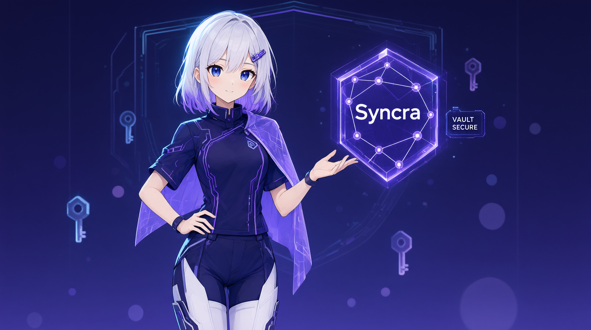
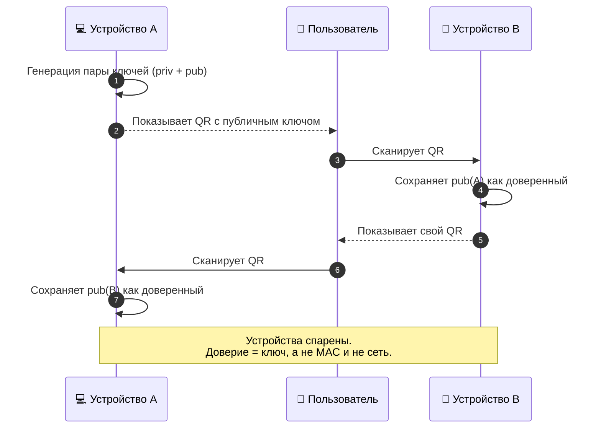
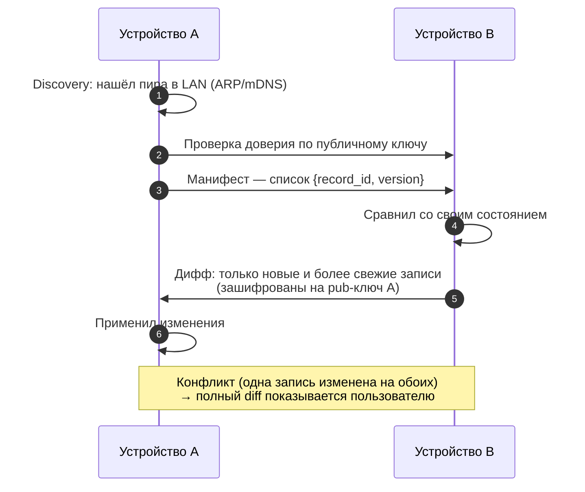
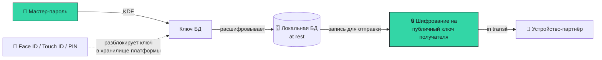
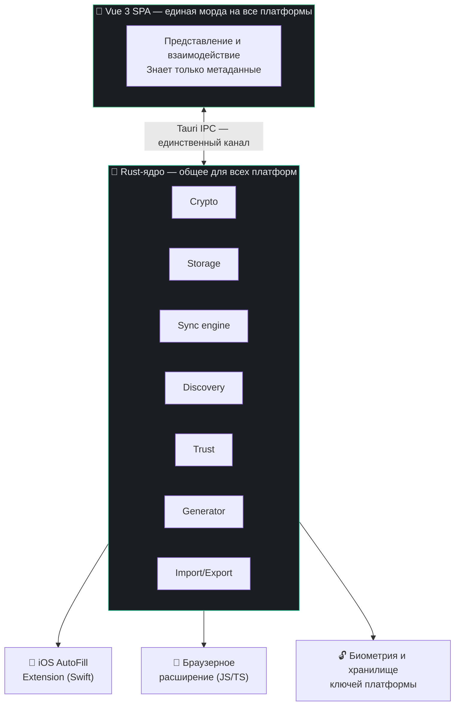
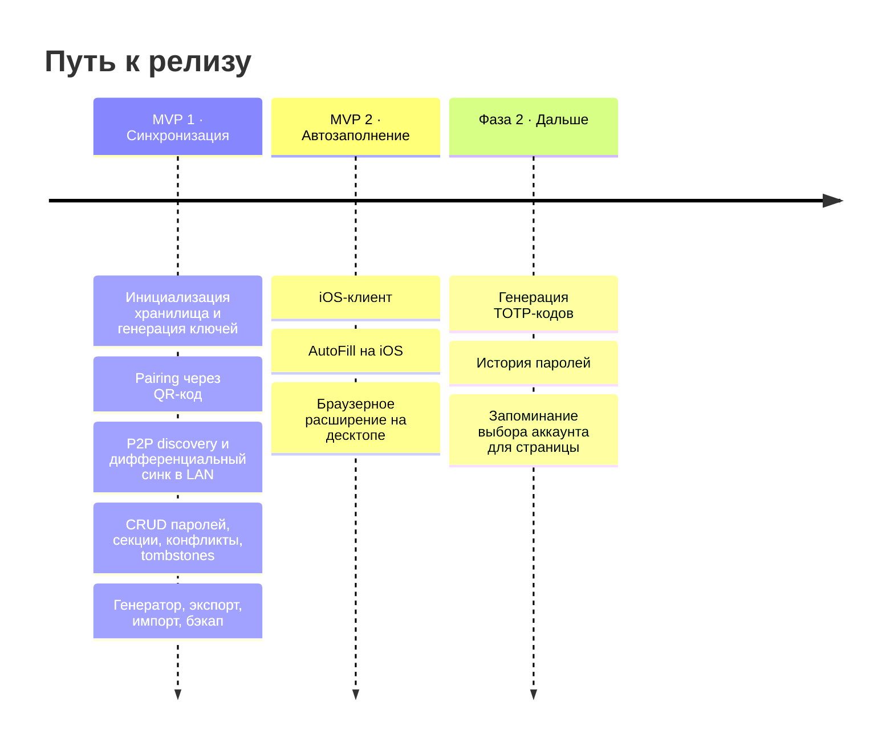

<p align="center">
  
</p>

<h1 align="center">Syncra</h1>

<p align="center">
  <b>Менеджер паролей без сервера.</b><br>
  Пароли живут на твоих устройствах и синхронизируются напрямую — по локальной сети, без облака и без посредников.
</p>

<p align="center">
  <a href="#-дорожная-карта"></a>
  <a href="#-стек-и-архитектура"></a>
  <a href="#-стек-и-архитектура"></a>
  <a href="#-стек-и-архитектура"></a>
</p>

<p align="center">
  <a href="#-в-чём-идея">Идея</a> ·
  <a href="#-как-это-работает">Как работает</a> ·
  <a href="#-модель-безопасности">Безопасность</a> ·
  <a href="#-стек-и-архитектура">Архитектура</a> ·
  <a href="#-быстрый-старт">Быстрый старт</a> ·
  <a href="#-дорожная-карта">Роадмап</a>
</p>

---

## ✦ В чём идея

У Syncra **нет сервера**. Совсем. Нет аккаунта, нет облака, нет компании, которой ты доверяешь свой сейф.

Каждое устройство хранит **полную реплику** данных и полностью работоспособно офлайн. Когда два твоих устройства оказываются в одной локальной сети — за одним домашним роутером — они находят друг друга, узнают по криптографическим ключам и обмениваются изменениями напрямую.

<table>
<tr>
<td width="33%" valign="top">

### 🏠 Local-first

Данные первичны на устройстве. Приложение не «ходит в сеть за паролями» — оно уже всё знает. Интернет для работы не нужен вообще.

</td>
<td width="33%" valign="top">

### 🔗 P2P-синхронизация

Прямой обмен между устройствами по LAN. Без ретрансляторов, без «зашифрованного бэкапа у провайдера», без единой точки отказа и утечки.

</td>
<td width="33%" valign="top">

### 🔑 Ключи вместо аккаунтов

Доверие строится на парах ключей и сопряжении через QR-код. Ты не «логинишься» — ты **знакомишь свои устройства** между собой.

</td>
</tr>
</table>

> [!NOTE]
> **Осознанное ограничение:** синхронизация работает только внутри одной локальной сети. Это не недоработка, а решение — оно сохраняет смысл P2P и убирает целый класс сложности (NAT-traversal, relay-серверы, «а кто это на самом деле в интернете»).

---

## ✦ Возможности

| | Возможность | Статус |
|:--:|---|:--:|
| 🔐 | **Хранилище паролей** — CRUD, поиск, секции (vaults), пометка reveal-полей | MVP 1 |
| 🔄 | **Дифференциальная P2P-синхронизация** по локальной сети | MVP 1 |
| 📱 | **Сопряжение через QR-код** — защита обмена ключами от MITM | MVP 1 |
| 🚫 | **Отзыв устройства (revoke)** — «у меня украли ноутбук» | MVP 1 |
| ⚖️ | **Разрешение конфликтов** — полный diff двух версий, выбирает человек | MVP 1 |
| 🎲 | **Генератор паролей** — профиль настроек один раз, N вариантов на выбор | MVP 1 |
| 📦 | **Импорт / экспорт / зашифрованный бэкап** | MVP 1 |
| 🧩 | **Автозаполнение** — браузерное расширение на десктопе, AutoFill на iOS | MVP 2 |
| ⏱️ | **TOTP-коды** — поле в схеме есть с первого дня, генератор кодов позже | Фаза 2 |

---

## ✦ Как это работает

### Сопряжение устройств

Новое устройство не «входит по email» — оно знакомится с уже доверенным устройством по внеполосному каналу: один показывает QR с публичным ключом, второй сканирует.



### Синхронизация

Обмен дифференциальный: сначала едет компактный манифест `{record_id, version}`, и только потом — то, чего у партнёра реально нет.



<details>
<summary><b>Как определяется «свежесть» записи</b></summary>

<br>

Основной критерий — **`version`**, монотонный счётчик изменений записи. Он работает полностью локально и не зависит от расхождения часов между устройствами.

`updated_at` хранится параллельно, но только **для показа пользователю** и как вспомогательный сигнал. Core-логика сравнения на время не завязана — это принципиально для распределённой системы без сервера времени.

</details>

<details>
<summary><b>Что происходит при удалении (tombstones)</b></summary>

<br>

Удаление так же важно, как добавление: если просто стереть запись, она «воскреснет» при следующей синхронизации с другого устройства.

Поэтому удалённая запись превращается в **надгробие (tombstone)**: остаются `record_id`, `deleted_at` и `version`, сами данные стираются. Надгробие расходится по сети доверия наравне с обычными записями.

**Срок жизни надгробий — 30 дней**, без пользовательской настройки. Расчёт: в подавляющем большинстве случаев цикл синхронизации происходит не реже раза в сутки (человек приходит домой в свою сеть), так что 30 дней надёжно покрывают риск воскрешения. Не чистить вообще — не вариант: база растёт бесконечно.

</details>

<details>
<summary><b>Что происходит при конфликте</b></summary>

<br>

Конфликт — это одна и та же запись (`record_id`), независимо изменённая на двух устройствах.

Syncra **не мержит автоматически и не угадывает**. Разрешение идёт на уровне целой записи: система показывает полный diff обеих версий с датами (какая раньше, какая позже), а пользователь выбирает **одну версию целиком**. В редких случаях, когда нужна ручная пересборка, весь diff перед глазами.

</details>

---

## ✦ Модель безопасности

Два независимых уровня шифрования — их важно не путать:



| Уровень | Что защищает | Механизм |
|---|---|---|
| **At rest** | Базу на диске: кража устройства, доступ к файлу | Ключ, выведенный из мастер-пароля (KDF класса Argon2/scrypt); секретные поля шифруются отдельно |
| **In transit** | Данные в момент синхронизации | Полезная нагрузка шифруется на публичный ключ получателя — расшифровать может только он |

**Биометрия — это удобство, а не отдельный секрет.** Мастер-пароль первичен и обязателен: прежде чем включить Face ID или PIN, пользователь вводит его. Биометрия лишь разблокирует ключ в защищённом хранилище платформы (iOS Keychain / Secure Enclave, аналоги на десктопе). Мастер-пароль остаётся универсальным фолбэком на всех платформах.

> [!IMPORTANT]
> **Честно про revoke.** Отзыв устройства обрезает его от *будущих* синхронизаций, но украденное устройство **уже имеет полную реплику паролей на диске**. Настоящая линия обороны при краже — шифрование at-rest: без мастер-пароля база не открывается. Revoke — дополнительный механизм, а не основная защита. В децентрализованной сети отзыв не решается на 100%, и это принятое ограничение MVP.

### Закон №1 архитектуры

> **UI ничего не знает о секретах, ключах и сети.**

Вся security-критичная логика живёт в Rust-ядре и никогда не покидает его в открытом виде. Расшифрованный секрет попадает во фронтенд **только** в момент явного reveal или копирования — разово, через IPC, и не оседает ни в сторе, ни в `localStorage`. Криптографического кода на JavaScript в проекте нет вообще.

<details>
<summary><b>Ещё одно следствие: никаких фавиконов из интернета</b></summary>

<br>

Иконки сервисов в списке — **только локальные заглушки** (первая буква, генеративный аватар по домену). Тянуть фавиконы с чужих серверов означает сливать стороннему провайдеру список того, какими сервисами ты пользуешься. Для local-first продукта это идейно недопустимо, даже если выглядит красиво.

</details>

---

## ✦ Модель данных

Единица данных всей системы — **запись (`record`)**. Именно она синхронизируется, имеет tombstone и участвует в разрешении конфликтов. Никаких сущностей «выше» записи нет.

| Поле | Класс | Назначение |
|---|:--:|---|
| `record_id` (UUID) | meta | Стабильный идентификатор. Ключ синхронизации и конфликтов |
| `vault_id` | meta | Ссылка на секцию/vault |
| `service_name` | meta | Отображаемое имя. **Не уникально**, для матчинга не используется |
| `urls[]` | meta | Список доменов входа — основа автозаполнения |
| `login` | meta | Логин пользователя |
| `account_label` | meta | Метка аккаунта: «личный», «рабочий» |
| `password` | 🔒 | Пароль |
| `notes` | 🔒 | Заметки: контрольные вопросы, коды восстановления |
| `totp_secret` | 🔒 | Секрет для 2FA |
| `version` | meta | Счётчик версий — критерий свежести |
| `created_at` / `updated_at` | meta | Даты создания и последнего изменения |
| `password_updated_at` | meta | Дата смены **именно пароля** — для подсказок о ротации |
| `deleted_at` | meta | Tombstone; `null` для живых записей |

**Несколько аккаунтов на одном сервисе — это норма, а не крайний случай.** Каждый аккаунт — самостоятельная запись со своим `record_id`; сущности-контейнера «сервис» намеренно нет. Совпадение `service_name` и `urls` — опора продукта, а не коллизия. Группировка личного и рабочего `google.com` — чисто визуальный приём, в модели данных и протоколе синхронизации при этом **ноль изменений**.

Если под страницу подходит несколько записей — система **не угадывает**, а показывает пикер. Записи в нём различаются по `login` и `account_label`.

<details>
<summary><b>Что сознательно НЕ вошло в MVP — и почему</b></summary>

<br>

| Не включено | Причина |
|---|---|
| Вложения и файлы | Противоречит принципу «минимизируем трафик синка»; это отдельная подсистема хранения блобов |
| Теги | Дублируют vaults на текущем масштабе; чистое аддитивное поле, безопасно добавить потом |
| Кастомные key-value поля | Почти всё закрывают `notes` — без вариативной схемы и лишней UI-сложности |
| История паролей | Пост-MVP; базовую потребность частично закрывает diff при конфликте |
| Фавиконы из сети | Утечка «какими сервисами пользуешься» стороннему провайдеру |
| `item_type` (карты, заметки, удостоверения) | Syncra остаётся сфокусированным менеджером **паролей** |

Отдельное исключение — **`totp_secret`**: поле заложено в схему с первого дня, хотя генератор кодов появится позже. Причина в том, что добавить новое **секретное** поле в уже синхронизируемую зашифрованную схему потом = миграция зашифрованных данных на всех устройствах. Дорого. Дешевле зарезервировать сразу.

</details>

---

## ✦ Стек и архитектура

Общий UI + общее ядро + тонкий нативный слой на каждую платформу. Не «отдельные приложения под каждую ОС», но и не «одно на всё».



| Слой | Технология | Роль |
|---|---|---|
| Оболочка / рантайм | **Tauri 2** | Десктоп и iOS из одной кодовой базы. Нативный webview вместо бандла Chromium: WebView2, WebKitGTK, WKWebView |
| Ядро | **Rust** | Вся security-критичная логика: крипта, сеть, хранилище, синхронизация |
| UI | **Vue 3 + TypeScript** | Единая SPA. Только представление; общается с ядром через IPC |
| iOS-интеграция | **Swift** | AutoFill Credential Provider Extension — обязательно нативно, требование Apple |
| Десктоп-автозаполнение | **WebExtension** | Отдельный JS/TS-проект; хранилище не держит, ходит в запущенное приложение |

### Модули ядра

| Модуль | Ответственность |
|---|---|
| **Crypto** | Пара ключей устройства; KDF из мастер-пароля; шифрование секретов at-rest и полезной нагрузки in-transit |
| **Storage** | SQLite: записи, версии, tombstones, секции, доверенные устройства и их ключи |
| **Sync engine** | Дифференциальный протокол поверх TCP: манифест, вычисление диффа, подготовка конфликтов |
| **Discovery** | Обнаружение пиров в LAN (ARP/mDNS). Только обнаружение — доверие проверяется по ключам отдельно |
| **Trust** | Pairing через QR, хранилище публичных ключей, revoke и его распространение |
| **Generator** | Профиль настроек генерации + выдача N вариантов пароля |
| **Import/Export** | CSV для миграции и зашифрованный бэкап |

### Платформы

| Платформа | Статус | Роль |
|---|:--:|---|
| Windows | ✅ в скоупе | Десктоп-клиент |
| Linux | ✅ в скоупе | Десктоп-клиент |
| iOS | ✅ в скоупе | Мобильный клиент + системный AutoFill |
| Браузерное расширение | ✅ в скоупе | Десктопное автозаполнение |
| Android | ⛔ вне скоупа | Пока не планируется |
| macOS | — | Не заявлено |

---

## ✦ Быстрый старт

> [!WARNING]
> Проект в активной разработке. Rust-ядро ещё не готово — фронтенд разрабатывается против **мок-ядра** (in-memory фейк с теми же сигнатурами IPC, сид-данными и эмуляцией ошибок). Реальный и мок-клиент взаимозаменяемы за одним интерфейсом.

**Требования:** Node ≥ 22.18 (на Node 20 не стартуют vitest-тесты в jsdom).

```bash
git clone https://github.com/vafle228/Syncra.git
cd Syncra/client

npm install
npm run dev          # дев-сервер против мок-ядра
```

<details>
<summary><b>Остальные команды</b></summary>

<br>

```bash
npm run build        # прод-сборка (typecheck + build)
npm run typecheck    # vue-tsc
npm run lint         # ESLint
npm run lint:fix     # ESLint с автофиксом
npm run format       # Prettier
npm run test         # Vitest
npm run test:watch   # Vitest в watch-режиме
```

</details>

### Структура репозитория

```
Syncra/
├── client/              # Vue 3 SPA — единая морда на все платформы
│   ├── src/core/        # IPC-клиент, контракт с ядром, мок-реализация
│   ├── design/          # Макеты и дизайн-система
│   └── TASKS.md         # План работ по фронтенду
├── server/              # Rust-ядро (в работе)
└── syncra-spec.md       # 📖 Спецификация — источник истины по продукту
```

---

## ✦ Дорожная карта

Синхронизация первична, но релиз без автозаполнения не планируется. Отсюда две фазы:



<details>
<summary><b>Открытые вопросы</b></summary>

<br>

- **Контракт протокола синхронизации** — формат манифеста, установление сессии, шифрование канала, обработка обрывов поверх TCP
- **Защита CSV-экспорта на уровне UX** — формулировки предупреждений, напоминание удалить файл
- **Защита от повторного добавления отозванного устройства**
- **Доступ iOS-расширения к хранилищу** — общий App Group контейнер + общий Keychain access group
- **Связь «браузерное расширение ↔ приложение»** — native messaging или локальный IPC, и его защита
- **Финальный выбор крипто- и БД-библиотек** в рамках заданных категорий

</details>

---

## ✦ Документация

| Документ | О чём |
|---|---|
| [`syncra-spec.md`](syncra-spec.md) | Полная спецификация продукта: модель данных, протокол синхронизации, границы MVP |
| [`client/CLAUDE.md`](client/CLAUDE.md) | Рабочие правила фронтенда: граница с ядром, конвенции, Definition of Done |
| [`client/TASKS.md`](client/TASKS.md) | План работ по клиенту |

---

## ✦ Глоссарий

<details>
<summary><b>Развернуть</b></summary>

<br>

| Термин | Значение |
|---|---|
| **Local-first** | Данные первично живут на устройстве и полностью работоспособны без сети и сервера |
| **P2P-синхронизация** | Прямой обмен данными между устройствами без посредника-сервера |
| **Vault / Секция** | Логическая группа паролей («личное», «рабочее») |
| **Tombstone** | Метка удаления записи, распространяемая при синхронизации, чтобы запись не воскресла |
| **Version** | Монотонный счётчик изменений записи; критерий свежести, устойчивый к расхождению часов |
| **Pairing** | Сопряжение двух устройств с обменом публичными ключами через QR |
| **Revoke** | Отзыв устройства из доверенных |
| **AutoFill** | Автозаполнение учётных данных средствами ОС или браузера |
| **App Group / Keychain access group** | Механизмы iOS для общего доступа к данным и ключам между приложением и его расширением |

</details>

---

<p align="center">
  <sub>Твои пароли. Твои устройства. Больше ничьи.</sub>
</p>
